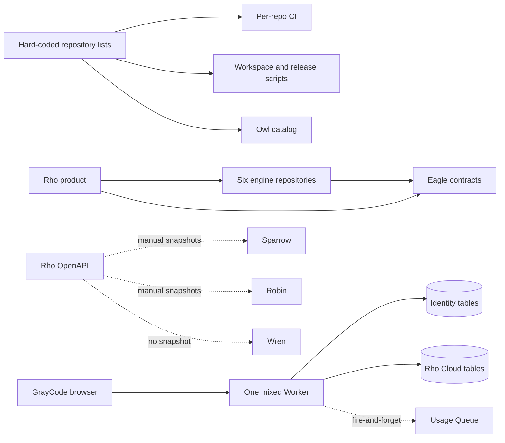
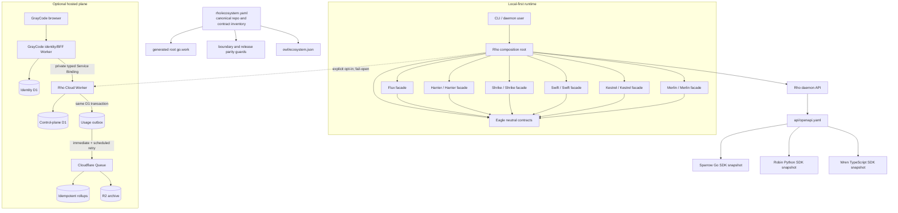

# GrayCode ecosystem wiring

> **STALE (2026-09-18):** Diagrams below predate `eagle` removal (2026-09-04) and list 14 repos / 6 engines. Canonical inventory is `ecosystem.yaml` (now 6 repos: `rho`, `flux`, `graycode-skills`, `graycode-platform`, `rover`, `across`). Use that for workspace/boundary checks. See `PLAN.md` at eco root for remediation.

> NOTE (2026-09-04): `eagle` contracts vendored into `rho/internal/contracts`.

This document is the historical implementation contract. `ecosystem.yaml` is the canonical machine-readable inventory.

## Current state before this change

The runtime engine integrations were mostly sound, but the surrounding wiring
could drift: repository names appeared independently in shell scripts and Owl,
SDK contracts were inconsistent, browser identity and the Rho control plane
shared a Worker and D1 binding, and a successful usage write did not guarantee a
durable Queue-delivery intent.

## Implemented architecture

## Ownership rules

| Boundary | Owner | Rule |
|---|---|---|
| Product orchestration | Rho | Engines never orchestrate Rho or one another. |
| Provider runtime | Flux | Rho imports its supported `engine` facade. |
| Shared data contracts | Eagle | Neutral types only; no product behavior. |
| Portable local graph | Source engine/Rho | Emit bounded `rho.graph/v1` facts without raw secrets or prompts. |
| Daemon HTTP API | Rho | `rho/api/openapi.yaml` is authoritative. |
| SDK endpoint support | Each SDK | Exact contract snapshot plus an explicit decision for every path. |
| Browser identity | GrayCode BFF | Users, sessions, email, API keys, and UI activity remain in identity D1. |
| Hosted control plane | Rho Cloud | Organizations, projects, devices, usage, billing, graph ledger, and audit. |
| Cloud delivery | D1 outbox + Queue | Business state and delivery intent commit together; consumers are idempotent. |
| Architecture discovery | Owl | Generated projection of the canonical manifest, never a second inventory. |

## Repository identity

Repository directories are repository and Go module identities. Product names
remain the user-facing labels. In particular, `flux` is Flux. Scripts and CI
must use `directory`/`github_repo`; UI copy may use `product_name`.

## Contract and event flow

1. Engine packages expose only the facade declared in `ecosystem.yaml`; the
   manifest validator rejects a missing or out-of-module facade.
2. Eagle commit `9d358dde4ad8` is the cross-repository contract revision, pinned
   through its reachable Go pseudo-version until the next semver tag is published;
   the parity gate checks every declared consumer.
3. Local graph projections use `rho.graph/v1`. Rho Cloud independently
   validates and privacy-normalizes them into `graycode-cloud.graph/v1`.
4. Usage ingestion commits its idempotency claim, budget counter, event,
   billing ledger row, daily activity projection, and `usage.recorded.v1`
   outbox record in one ordered D1 batch.
5. Queue publication is at-least-once. A successful send marks the outbox row;
   failures back off and the cron drain retries them. Queue consumers dedupe on
   `eventId`, so a send/mark race cannot double-count.

## Release and development workflow

- Run `make workspace` in Rho to regenerate the parent `go.work`.
- Run `make boundaries` to validate the inventory, module isolation, Eagle
  parity, facade locations, and support-repository coupling.
- Root `go.mod` files never contain local `replace` directives. Local sibling
  substitutions exist only in the generated, uncommitted parent workspace.
- SDK CI checks its snapshot byte-for-byte against Rho and separately checks
  that every OpenAPI path has a support decision.
- Run `owl/scripts/sync-ecosystem.sh` after changing the canonical inventory;
  Owl CI rejects drift.
- Standalone/module-mode tests remain the release truth; workspace tests are an
  additional integration pass, not a substitute.

### Coordinated Go publication gate

The compatible Eagle-migrated Flux source is currently ahead of Flux's
published `origin/main`. Do not merge or release Rho against the older Flux
pseudo-version: it still exposes the retired `rho-core-contracts` types and is
not type-compatible with Rho's Eagle boundary.

1. Merge and publish the Flux ecosystem-wiring branch first.
2. Resolve that final remote commit to its canonical Go pseudo-version with
   `go list -m github.com/GrayCodeAI/flux@<commit>`.
3. Update Rho's Flux requirement, run `GOWORK=off go mod tidy`, and remove any
   transition excludes no longer required by the published engine graphs.
4. Require Rho's `public-modules` and `release-parity` CI jobs to pass before
   merging or tagging Rho.

This publication is intentionally not performed by the source implementation:
remote branch merges and tags are externally visible release operations.

## Deployment sequence for the Worker split

1. Create or automatically provision the `rho-identity` D1 database and
   confirm its binding in `apps/bff/wrangler.jsonc`.
2. Export the existing identity tables from the legacy mixed database and
   import them into the identity database; verify row counts and login flows.
3. Deploy `graycode-cloud` with the named `RhoCloudService` entrypoint and
   apply migration `0023_usage_outbox.sql`.
4. Deploy `rho-bff` with its D1 binding and private service binding.
5. Point the web frontend API hostname at the BFF. Rho/CLI device start and
   poll traffic continues to target Rho Cloud.
6. After a rollback window, remove the legacy identity tables from the old
   cloud D1 using a separately reviewed data-retirement migration.

The database move is intentionally an operator-controlled deployment step:
creating Cloudflare resources or deleting the legacy copy is not safe to infer
from source-code changes alone.
